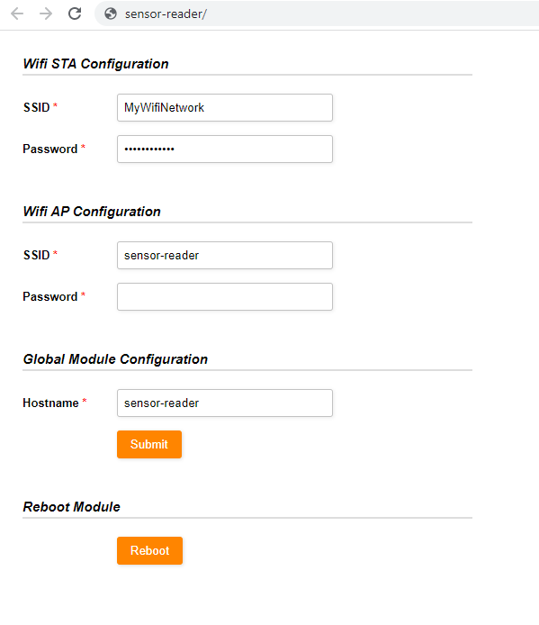

# ESPWifiConfigurator

Yet another ESP8266/ESP32 library for an easy wifi setup. 

When started, the module will provide the following setup page

* http/192.168.4.1/configuration/wifi or
* http/sensor-reader/configuration/wifi

depending on the browser/device the hostanme will not resolve to the module IP. 

The module ip will be available through the serial connection too.

# The interface
Any comments are useless 

